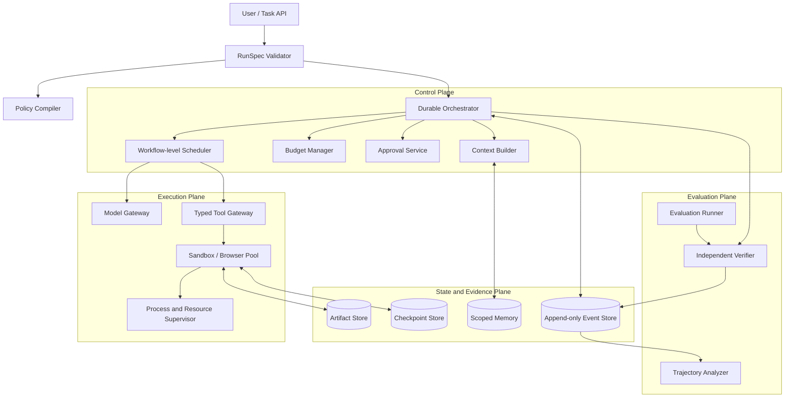
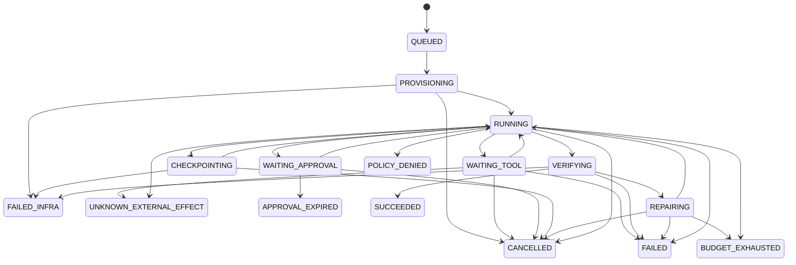

# LLMエージェント実行基盤アーキテクチャ調査

## 最新研究10本から導く、実装・評価・運用ハーネスの参照設計

| 項目 | 内容 |
|---|---|
| 調査日 | 2026-07-23 |
| 主対象期間 | 2024-07-23〜2026-07-23 |
| 期間外例外 | 後続の実行基盤設計を規定した基準論文2本 |
| 対象 | agent runtime、harness、ACI、scheduler、sandbox、checkpoint、evaluation infrastructure |
| 想定読者 | エージェント開発基盤の設計・投資・技術選定を行う人 |
| 成果物 | 本書一冊。内部要件メモは成果物に含めない |

---

## 0. このレポートが答える問い

### 0.1 読者が本当に知りたいこと

この調査の目的は、LLMエージェント研究を広く知ることではない。読者が知りたいのは、**エージェントを効率的かつ再現可能に開発・評価・運用するために、どのような実行基盤を実際に整備すべきか**である。

その判断を、次の問いへ分解した。

1. モデルの外側に、どのcomponentと責務を置くべきか。
2. agent、harness、model、tool、sandbox、evaluatorをどの境界で分離すべきか。
3. 一つのtaskを動かす制御フローと状態機械はどうあるべきか。
4. 多数のagent workflowを動かすschedulerは、個別LLM requestではなく何を単位に管理すべきか。
5. 長時間実行や分岐探索で、conversation、filesystem、process stateをどう保存・復旧すべきか。
6. ACIとtool contractをどう設計すれば、context浪費と誤操作を減らせるか。
7. harnessの改善とmodelの改善を、どう分離して評価すべきか。
8. 何を最初に作り、何を後回しにし、何を作らないべきか。
9. 自社で保持すべきcontrol pointと、外部製品を利用できる部分はどこか。
10. どのKPIと導入gateを満たせば、本番で権限を拡大してよいか。

### 0.2 本書でいう「実行基盤アーキテクチャ」

本書では、次のうち複数を具体的に記述する研究を主対象とする。

- componentと責務
- control flow / data flow
- state、memory、artifactの境界
- action / observation / tool contract
- concurrency、scheduling、resource management
- isolation、sandbox、authority boundary
- timeout、retry、checkpoint、rollback、recovery
- trace、cost、evaluation、reproducibility

単にagentの成功率を測るbenchmark、memory手法だけの研究、数学推論だけのtest-time compute研究は、重要でも主要10本には入れない。

### 0.3 「効率」の定義

成功率だけを効率とは呼ばない。本書では次を同時に扱う。

```text
verified quality
÷
{ API cost, token, wall-clock, GPU, CPU, memory, storage,
  human effort, failure/recovery cost, unsafe side effect }
```

### 0.4 用語と表記

| 用語 | 本書での意味 |
|---|---|
| agent（エージェント） | model callとtool/environment interactionを組み合わせた実行process |
| harness（ハーネス） | context、workflow、tool、state、retry、verification、stopを組み立てる外部実行system |
| runtime（ランタイム） | harnessの指示を実行し、model、tool、resource、state transitionを管理する機構 |
| ACI | Agent-Computer Interface。agent向けのaction / observation契約 |
| sandbox | agent actionを隔離して実行するcontainerまたはVM |
| checkpoint / restore | ある時点のstateを保存し、そこへ復元すること |
| scaffold | modelの周囲のprompt、loop、tool、memory等を組み合わせたagent構成。HALの用語に合わせる |
| Semantic Scholar | 被引用指標の参照に用いた学術索引。本文では略号S2を使わない |
| plane（機能面） | 同種の責務をまとめたarchitecture上の区分。network planeを意味しない |

本書には英語のAPI名と論文固有語が多いため、一般概念は初出で日本語説明を付け、schema fieldや原論文用語は英語を保持する。

### 0.5 前提と対象外

- coding、Web、research、enterprise tool-useを載せられる共通基盤を想定する。
- 特定cloud、model provider、agent frameworkへの固定は前提にしない。
- model training architectureそのものは対象外とする。
- 本書は2026年7月時点の研究を基にする。2026年のpreprintは有望性を示すが、査読済み研究と同じ確度では扱わない。

---

## 1. 意思決定サマリー

### 1.1 結論

整備すべきものは「巨大なmulti-agent framework」ではない。推奨するのは、次の五つのplaneを持つ実行基盤である。

1. **Specification plane**
   task、harness policy、model、tool、環境、予算、権限、評価条件をversion付きRunSpecにする。

2. **Control plane**
   durable orchestrator、state machine、budget manager、policy/approval、workflow-level schedulerを置く。

3. **Execution plane**
   model gateway、typed tool gateway、短命sandbox/browser、resource supervisorを置く。

4. **State and evidence plane**
   append-only event、artifact、checkpoint、environment state、verification resultを分離保存する。

5. **Evaluation plane**
   model × harness × environment × benchmarkを独立componentとして比較し、agentとは別権限で採点する。

### 1.2 参照アーキテクチャ



### 1.3 最初に作るもの

| 優先 | 機能 | 判断 |
|---|---|---|
| P0 | RunSpec、run state machine、event log | 必須 |
| P0 | typed tool gateway、side-effect分類、hard budget | 必須 |
| P0 | task単位sandbox、network/secret/resource policy | 必須 |
| P0 | 独立verifier、artifact、状態ベース評価 | 必須 |
| P1 | bounded ACI、structured error、transactional edit | 必須 |
| P1 | model × harness × environmentの評価分離 | 必須 |
| P1 | process supervisor、timeout、cancel、best artifact保持 | 必須 |
| P2 | workflow-aware scheduling、KV/tool lifecycle管理 | 負荷が増えたら導入 |
| P2 | conversation + filesystem + process checkpoint | 長時間runで導入 |
| P2 | declarative harness policy | harnessが増えたら導入 |
| P3 | 高頻度rollback substrate | tree search / RLで導入 |

### 1.4 最初は作らないもの

- 自由に再帰spawnするagent swarm
- 全agentが全tool、全secret、全memoryを共有する構成
- self-declared completionだけで成功とする構成
- 生のshell、URL、SQLを無制限に実行するtool
- conversationだけを保存して「checkpoint」と呼ぶ機能
- 全turnのfull VM snapshot
- online本番trafficで自己変更するharness
- 一つの公開benchmarkだけを最適化するrouter
- LLM-as-a-judge単独のrelease gate

### 1.5 強い根拠と未成熟な部分

| 判断 | 根拠強度 | 理由 |
|---|---|---|
| ACIの出力量・error・edit transactionが重要 | E2 | SWE-agentのablation。BrowserGymは実装例 |
| agent / runtime / evaluatorの分離 | E2 | OpenHands、BrowserGym、HALの実装・大規模運用 |
| request単位でなくworkflow単位で資源管理 | E2 | ThunderAgentの直接評価。AIOSはsyscall単位 |
| conversationだけでは完全復旧できない | E2 | Crabのfault-injection評価 |
| 高頻度探索には差分checkpointが有効 | E2 | DeltaBox。2026 preprint |
| harness policyの外部化 | E2 | NLAH。2026 preprint |
| multi-agentを既定にする | 支持なし | Magentic-Oneは用途例であり、一般優位を証明しない |
| microVMが全用途で必須 | 支持なし | threat modelとworkloadによる |

E1は複数研究、E2は単一または限定領域の直接証拠、E3は合理的外挿、Pは実務原則、Hは検証仮説を表す。

---

## 2. 調査方法

### 2.1 検索方針

2026-07-23時点で、次の概念を組み合わせて原論文を探索した。

- LLM agent runtime / execution architecture
- agent operating system / scheduler
- agent harness / scaffold architecture
- agent sandbox / checkpoint / rollback
- agent evaluation infrastructure
- event-driven / durable agent execution
- agent-computer interface
- program-aware agent serving

検索先はarXiv、OpenReview、会議proceedings、著者・研究機関の公式publication page、原論文が参照する公式repositoryである。

### 2.2 Screening

38候補を次の順でscreeningした。候補数と分類は、下記criteriaを使った本調査者のjudgment-based screeningであり、bibliometric databaseから自動生成した系統レビューではない。全候補と除外理由は付録Aに示す。

```text
候補38
├─ architectureが中心でない: 12
├─ survey・仕様書・二次資料: 5
├─ 単一moduleでruntime全体を扱わない: 6
├─ architecture記述または実験が弱い: 5
└─ 主要10本
```

### 2.3 Inclusion criteria

以下のうち四つ以上を満たすことを原則とした。

1. architectureが論文の主要貢献である。
2. componentとcontrol flowが明示される。
3. stateまたはenvironment境界が明示される。
4. failure、scheduling、isolation、evaluationの少なくとも一つを扱う。
5. 実装またはcodeが公開される。
6. 定量評価、ablation、fault injectionのいずれかがある。
7. 査読採択、被引用、利用規模、最新性のいずれかが強い。

### 2.4 最新性と影響度の両立

引用数だけで選ぶと2026年のsystems研究を落とす。一方、最新性だけで選ぶと未検証preprintに偏る。そのため、10本を二群に分けた。

- **影響力アンカー 5本**: 査読・被引用・後続利用が蓄積した基盤設計。
- **frontier architecture 5本**: 2025後半〜2026に登場し、実行基盤の未解決問題を直接扱う研究。

### 2.5 引用数の注意

被引用数には「公式な唯一の値」がない。Semantic ScholarではarXiv版と会議版の統合状態により、SWE-agentのように同一論文へ大きく異なるrecordが存在する。OpenAlexも会議版とpreprint版を分離する場合がある。引用指標は2026-07-23 UTC取得で、取得recordを付録Bに示す。

本書では、厳密な順位付けより次を優先した。

- 取得元と取得日を明記する。
- record重複を合算しない。
- 2026年論文は「引用未蓄積」と明記する。
- arXivが公開しない閲覧数を推定しない。

### 2.6 選定した10本

| # | 論文 | 年・位置づけ | architecture中心性 | 影響指標の扱い |
|---|---|---|---:|---|
| 1 | SWE-agent | NeurIPS 2024 | 3/3 | 高被引用、期間前基準 |
| 2 | AIOS | COLM 2025 | 3/3 | 影響度: 中〜高。期間前基準 |
| 3 | OpenHands | ICLR 2025 | 3/3 | 影響度: 非常に高い。被引用・OSS利用とも大 |
| 4 | BrowserGym | TMLR 2025 | 3/3 | 影響度: 高い。複数Web benchmarkへ統合 |
| 5 | Magentic-One | MSR Technical Report 2024 | 3/3 | 影響度: 高い。未査読 |
| 6 | Holistic Agent Leaderboard | ICLR 2026 | 3/3 | 査読済み、21,730 rollouts |
| 7 | ThunderAgent | ICML 2026 | 3/3 | 査読済み、引用は未蓄積 |
| 8 | Crab | arXiv 2026 | 3/3 | 引用未蓄積、fault injection |
| 9 | DeltaBox | arXiv 2026 | 3/3 | 引用未蓄積、OS substrate |
| 10 | Natural-Language Agent Harnesses | arXiv 2026 | 3/3 | 引用未蓄積、harness直接研究 |

### 2.7 主要な落選候補

| 候補 | 扱い | 理由 |
|---|---|---|
| Agentless | 補助証拠 | 固定pipeline設計として重要だがruntime全体ではない |
| AFlow | 補助証拠 | offline workflow optimizerであり実行substrateではない |
| MLE-bench | 補助証拠 | scaffold差を示すがarchitecture自体が主研究対象ではない |
| RE-Bench | 補助証拠 | 長時間失敗分析は重要だがruntime architecture論文ではない |
| A-MEM | 補助証拠 | memory moduleに限定される |
| Why Do Multi-Agent LLM Systems Fail? | 補助証拠 | taxonomyであり新規runtime提案ではない |
| Scaling Test-Time Compute Optimally | 補助証拠 | compute policyでありagent execution substrateではない |
| ToolSandbox | 補助証拠 | stateful evaluationには重要だが主にbenchmark |
| Terminal-Bench 2.0 | 補助証拠 | Harborは重要だが論文の中心はtask setとagent比較 |
| AgentCompass | watch list | 2026-07公開直後。評価infraとして有望だが実証蓄積前 |
| AutoGen v0.4 | 公式実装資料 | actor architectureの査読論文がないため主要論文から除外 |

この選定変更により、前稿のMLE-bench、RE-Bench、A-MEM、test-time compute、MAS failure taxonomyは主要10本から外れた。いずれも有用だが、今回の読者が求める「実行基盤アーキテクチャ」を直接説明する論文ではなかったためである。

---

## 3. 論文別アーキテクチャ分析

## 3.1 SWE-agent: Agent-Computer Interfaces Enable Automated Software Engineering

### 書誌と選定理由

- John Yang et al.
- NeurIPS 2024
- 初版: 2024-05-06
- 原典: [arXiv:2405.15793](https://arxiv.org/abs/2405.15793)
- 会議版: [NeurIPS Proceedings](https://papers.nips.cc/paper_files/paper/2024/hash/5a7c947568c1b1328ccc5230172e1e7c-Abstract-Conference.html)
- 選定理由: agentとcomputerの境界をarchitectureの主題にし、ACI componentをablationした基準論文。

### 解こうとした問題

人間向けshellをそのままLMへ渡すと、表示量、検索、編集、error feedbackがLMの能力と合わない。モデルを変更せず、interface設計だけでsoftware taskの成功率を改善できるかを問う。

### 提案アーキテクチャ

```text
Issue
  ↓
LM Agent / ReAct controller
  ↓ thought + one command
Parser
  ↓ validated action
Agent-Computer Interface
  ├─ file viewer
  ├─ summarized search
  ├─ transactional editor + lint
  └─ shell/test
  ↓
Docker repository environment
  ↓ observation
History processor
  ↓ bounded context
LM Agent
```

実装は`agent`、`environment`、`logging`の三moduleに分かれる。ACIはYAMLでprompt、command、parser、history processor、environment variableを宣言する。

### Action / observation contract

- 一turn一command。
- file viewerは100行window。
- searchは最大50件。多すぎる場合、巨大出力を返さずquery refinementを求める。
- stdoutが空でも、成功して出力がないことを明示する。
- malformed actionは再生成させる。
- edit actionは適用後にselective lintを行い、新たなlint errorを導入したinvalid editを破棄する。
- invalid edit時はbefore/after、error、周辺codeを返して再編集を求める。
- 推論用contextでは古いobservationを圧縮するが、完全trajectoryはlogへ残す。

### State、failure、evaluation

- environment state: filesystem、cwd、process。
- ACI state: current file、line、search result index。
- controller state: 圧縮されたmessage history。
- 最終成果: agentの完了文ではなくrepository diff。
- evaluator: agentから分離したSWE-bench hidden tests。
- 1 instance当たり$4で停止し、残存patchを提出する。

### 実験と効果

GPT-4 TurboはSWE-bench全2,294件で12.47%、Liteで18.0%。Shell-only 11.0%に対し、専用ACIは18.0%で相対64%改善した。

主要ablation（Table 3）:

| 変更 | Lite成功率 |
|---|---:|
| 完全ACI | 18.0% |
| lintなし | 15.0% |
| 専用editなし | 10.3% |
| summarized search | 18.0% |
| interactive search | 12.0% |
| viewer 100行 | 18.0% |
| file全文 | 12.7% |
| 直近5 observation | 18.0% |
| full history | 15.0% |

### 証明したこと

**E2:** LM向けにbounded observation、transactional edit、structured feedbackを設計すると、同一model・同一taskで成功率が変わる。

### 証明していないこと

- coding以外でも同じcommand集合が最適とは限らない。
- Docker environmentのsecurityは評価していない。
- checkpoint/resume、distributed scheduling、multi-agent runtimeは扱わない。

### 実装判断

採用する:

- versioned ACI
- full traceとinference contextの分離
- bounded search/view
- action直後の安価なdeterministic guard
- budget超過時のpartial artifact保持

採用しない:

- SWE-agent固有commandを全domainの標準にすること
- shellだけを万能toolとみなすこと

---

## 3.2 AIOS: LLM Agent Operating System

### 書誌と選定理由

- Kai Mei et al.
- COLM 2025
- 初版: 2024-03-25、現行arXiv v5
- 原典: [arXiv:2403.16971](https://arxiv.org/abs/2403.16971)
- 選定理由: scheduler、context switch、memory、storage、tool、accessをkernel serviceとして統合し、No-AIOSとの比較を持つ。

### 解こうとした問題

各agentがLLM、tool、memoryへ直接アクセスすると、同時実行時のresource競合、context切替、tool conflict、access controlが各frameworkへ重複実装される。これらをagent applicationからkernelへ移せるかを問う。

### 提案アーキテクチャ

```text
Application Layer
  Agent / Framework adapters / AIOS SDK
              ↓
Kernel Layer
  Agent Scheduler
    ├─ LLM Core
    ├─ Context Manager
    ├─ Memory Manager
    ├─ Storage Manager
    ├─ Tool Manager
    └─ Access Manager
              ↓
OS / Hardware / Model endpoint / Tools
```

agent queryをLLM、memory、storage、toolのsyscall列へ分解し、中央queueから各managerへdispatchする。

### Stateとscheduling

- LLM生成の中断時にcontext snapshotを取り、再開する。
- closed modelでは生成済みtext、logitを取得できるmodelではsearch stateを保存する。
- runtime memoryはconversation logとtool resultを扱う。
- memory使用量80%でLRU-Kによりpersistent storageへevictする。
- schedulerはFIFOとpreemptive Round Robinを実装する。
- tool managerはparameter validationとparallel conflict回避を行う。
- access managerはagent IDとprivilege groupを管理する。

### 実験

単一RTX A5000、Llama-3.1-8B / Mistral-7B、default最大250 concurrent agentsというresource-constrained条件で効率を評価した。別のscalability実験では、複製したHumanEval workloadを用いて250〜2,000 active agentsを測定した。

| 構成 | 総実行時間 | 平均待機 | p90待機 |
|---|---:|---:|---:|
| No AIOS | 152.1 s | 9.8 s | 11.0 s |
| FIFO | 74.2 s | 3.0 s | 5.0 s |
| Round Robin | 77.3 s | 3.2 s | 4.2 s |

workloadにより最大2.1倍の**AIOS system calls per second**改善を報告する。これはcompleted task throughput一般の2.1倍を意味しない。FIFOは総時間、Round Robinはtail fairnessで優位だった。

### 証明したこと

**E2:** LLMを共有bottleneckとする条件では、agent requestをkernel queueでscheduleしcontext switchすることで、無調整な同時実行より待機時間とthroughputを改善できる。

### 証明していないこと

- multi-GPU、cloud API、分散nodeで同じ効果が得られるとは限らない。
- durable queue、crash recovery、idempotent syscallはない。
- AIOSのaccess managerは強いmulti-tenant security boundaryではない。
- code sandboxを提供するarchitectureではない。

### 実装判断

採用する:

- agent applicationとresource managerの分離
- syscall queueとagent metadataを持つ中央scheduler
- context snapshot/restoreを独立serviceにすること
- memory、storage、tool、accessの責務分離

留保:

- OS metaphorをそのまま製品architectureにする必要はない。
- model servingが外部APIなら、GPU schedulerよりbudget/rate-limit schedulerが重要になる。

---

## 3.3 OpenHands: An Open Platform for AI Software Developers as Generalist Agents

### 書誌と選定理由

- Xingyao Wang et al.
- ICLR 2025
- 初版: 2024-07-23
- 原典: [arXiv:2407.16741](https://arxiv.org/abs/2407.16741)
- 公式: [OpenReview](https://openreview.net/forum?id=OJd3ayDDoF)
- 選定理由: agent、event stream、runtime、sandbox、browser、evaluationを統合した実装済みplatform。

### 解こうとした問題

agentごとにshell、browser、code execution、UI、evaluationを作り直すと、agent policyとruntimeが密結合する。複数agentと複数benchmarkを同一platformへ載せる共通境界を設計する。

### 提案アーキテクチャ

```text
User / UI
   ↕
State + chronological Event Stream
   ↕
Agent.step(State) → Action
   ↓
Runtime REST API
   ↓
Per-session Docker sandbox
   ├─ bash
   ├─ IPython/Jupyter
   ├─ file operations
   └─ Playwright/Chromium
   ↓
Observation → Event Stream
```

Actionは`CmdRunAction`、`IPythonRunCellAction`、`BrowserInteractiveAction`等の少数のgeneral primitive。任意Docker imageへAction Execution APIを注入できる。

### State、delegation、observability

- Stateはaction、observation、user feedback、累積LLM費用、delegation metadataを持つ。
- `AgentDelegateAction`で専門agentへsubtaskを渡せる。
- UIはfile、bash、Python、browser activityを表示し、人が介入できる。
- evaluation frameworkは15 benchmarkを共通実行する。

### 実験

論文時点のCodeActAgent + Claude 3.5 SonnetはSWE-bench Liteで約26.0%、平均約$1.10/task。software、Web、general assistanceを同一agent abstractionで評価できることを示した。

### 証明したこと

**E2:** event streamと共通runtime interfaceにより、異なるagent、Docker image、tool modality、benchmarkを一つのplatformへ統合できる。

### 証明していないこと

- event streamが成功率やlatencyを改善するarchitecture ablationはない。
- event streamはdurable event sourcing、exactly-once delivery、deterministic replayを意味しない。
- action並列実行、backpressure、distributed schedulerは論文で規定されない。
- Docker escape、network egress、secret isolationは評価していない。

### 実装判断

採用する:

- agent policyとruntimeの分離
- action / observationを共通event envelopeへ載せる
- general primitive + domain adapter
- taskごとの短命environment
- UI、human intervention、evaluationが同じeventを参照する構成

追加する:

- durable semantics
- idempotency
- explicit network/secret policy
- verifier権限分離

---

## 3.4 The BrowserGym Ecosystem for Web Agent Research

### 書誌と選定理由

- Thibault Le Sellier de Chezelles et al.
- TMLR 2025
- 初版: 2024-12-06
- 原典: [arXiv:2412.05467](https://arxiv.org/abs/2412.05467)
- 公式: [OpenReview](https://openreview.net/forum?id=5298fKGmv3)
- 選定理由: agent、environment、task validator、experiment managerをprotocolで分離したWeb実行基盤。

### 提案アーキテクチャ

```text
AgentLab
  ├─ study/config
  ├─ episode scheduler/retry
  ├─ token/cost/log
  └─ AgentXRay
         ↓
Agent.get_action(observation)
         ↕
BrowserGym Gymnasium API
  reset() / step(action)
         ↓
Chromium + Playwright
         ↕
Task.setup() / Task.validate()
         ↕
Benchmark backend + reset
```

### Action / observation contract

`reset()`は`observation, info`、`step()`は`observation, reward, terminated, truncated, info`を返す。

observationにはgoal/chat、tab、URL、screenshot、DOM、AXTree、bbox、visibility、BrowserGym ID、`last_action_error`を含められる。agent側が必要なmodalityを選ぶ。

actionはclick、fill、press、drag、tab、navigation、message、infeasible report、scroll等。Playwright exceptionはepisodeをcrashさせず、次のobservationで返す。

### State、reset、parallelism

- stateはDOM、rendering、cookie/session、tabs、chat、backend DB。
- episode resetとbackend resetを分離する。
- WebArena系はDocker backendを初期状態へ戻す。
- AgentLabはRayまたはmultiprocessで20〜100 episodeを並列化できる。
- benchmarkのbackend dependencyにより実効並列度が2〜4へ落ちる場合がある。
- failed episodeは最大3回再launchする。

### 実験

Table 2の8 benchmark rowsで合計5,978 evaluation episodes、6 model群を評価した。WorkArena L2ではClaude 3.5 Sonnet 39.1%、GPT-4o 8.5%。同時に、VisualWebArenaではGPT-4oがClaudeを上回り、model順位がenvironmentで変わることも示した。

### 証明したこと

**E2:** action/observation、task setup/validation、backend resetをprotocol化すると、異なるWeb benchmarkとagentを共通runnerで比較できる。

### 証明していないこと

- `bid`は観測内の参照を安定化するが、navigationや再実行を越える永続IDとは限らない。
- DOM、AXTree、screenshotのどの組合せが一般に最適かはablationしていない。
- live Webのdeterministic replayは保証しない。
- Web securityやprompt injectionへの防御は主題ではない。

### 実装判断

採用する:

- environmentをGym型protocolにする
- episode resetとservice/backend resetを分離する
- tool errorをstructured observationにする
- text/visual表現を共通element referenceで結ぶ
- dependency graphに基づく並列度制御

---

## 3.5 Magentic-One: A Generalist Multi-Agent System for Solving Complex Tasks

### 書誌と選定理由

- Adam Fourney et al.
- Microsoft Research Technical Report MSR-TR-2024-47
- 初版: 2024-11-07
- 原典: [arXiv:2411.04468](https://arxiv.org/abs/2411.04468)
- 公式: [Microsoft Research](https://www.microsoft.com/en-us/research/publication/magentic-one-a-generalist-multi-agent-system-for-solving-complex-tasks/)
- 選定理由: multi-agent controlを「会話」ではなく、明示的ledger、stall detection、replanで構成し、worker ablationを持つ。
- 留保: 査読会議論文ではない。

### 提案アーキテクチャ

```text
Orchestrator
  ├─ Outer loop: Task Ledger
  │    facts / unknowns / guesses / plan
  └─ Inner loop: Progress Ledger
       complete? in loop? progress?
       next worker? instruction?
          ↓
   ┌───────────────┬──────────┬────────┬──────────┐
   WebSurfer    FileSurfer   Coder   ComputerTerminal
```

### Control flowとstate

- outer loopが全体planとfactsをTask Ledgerへ保持する。
- inner loopが毎round、完了、loop、進捗、次speaker、instructionをProgress Ledgerへ書く。
- stall counterが閾値2以下なら局所回復を続ける。
- 閾値を超えるとinner loopを抜け、reflection、replan、worker context resetを行う。
- 一度にOrchestratorが一workerを選ぶため、team内部は基本逐次実行。
- task間の長期memoryは持たない。

### Runtime、evaluation、安全性

- WebSurferはChromium、FileSurferはread-only preview、CoderはPython、Terminalはshell/Python。
- AutoGenBenchがtaskごとにfresh Docker containerを起動し、logをhostへ保存する。
- GAIA、AssistantBench、WebArenaで評価。
- full Orchestratorを単純speaker selectorへ変えるとGAIA validationで31%低下。
- worker除去で21〜39%低下。

### 証明したこと

**E2:** 複雑taskのmulti-agent orchestrationでは、structured ledger、progress判断、stall-triggered replan、役割分離が、単純speaker selectionより有効になり得る。

### 証明していないこと

- multi-agentが同一予算single-agentを一般に上回るとは証明しない。
- team内部の並列schedulerではない。
- ledger判定そのものがLLMなので、完了・進捗判定は決定的ではない。
- process crash recoveryやdurable checkpointはない。

### 実装判断

採用する:

- plan stateとprogress stateの分離
- explicit stall counter
- bounded local recovery後のreplan
- workerごとのtool scope
- multi-agent component ablation

採用条件:

- single-agent baselineより同一予算で改善すること
- handoff artifactとcompletion criterionを型付けできること

---

## 3.6 Holistic Agent Leaderboard: The Missing Infrastructure for AI Agent Evaluation

### 書誌と選定理由

- Sayash Kapoor et al.
- ICLR 2026 Poster
- 初版: 2025-10
- 原典: [arXiv:2510.11977](https://arxiv.org/abs/2510.11977)
- 公式: [OpenReview](https://openreview.net/forum?id=vUaY1t64ZZ)
- 選定理由: model、scaffold、benchmarkを分離し、大規模に再実行する評価実行基盤を具体化した。

### 解こうとした問題

leaderboard scoreはmodelだけでなくscaffold、retry、tool、environment、cost accountingに左右される。既存評価はframeworkごとに実装が異なり、比較不能、遅い、再現しにくい。

### 提案アーキテクチャ

```text
Unified CLI / Config
     ↓
Benchmark adapter ─ Agent/Scaffold adapter
     ↓ minimal run(input) contract
Execution runner
  ├─ local / conda
  ├─ Docker
  └─ Azure VM orchestration
     ↓
Model provider via normalized client
     ↓
Central trace + token + cost logging
     ↓
Scoring + model × scaffold × benchmark leaderboard
     ↓
LLM-aided trajectory inspection
```

agent codeへ特定frameworkを要求せず、最小Python interfaceへ適合させる。VMのprovision、parallel execution、teardownをharnessが管理する。

### 実験規模

- 9 models
- 9 benchmarks
- 21,730 agent rollouts
- 約40,000ドル
- 2.5B tokensのmodel-call log
- 数百VMでweeksからhoursへ評価時間を短縮

cost–accuracy Paretoとmodel × scaffold × benchmarkの三軸分析を行う。higher reasoning effortが多数のrunでaccuracyを下げる等、単純な「計算を増やせばよい」に反する結果も報告した。

### 証明したこと

**E2:** agent evaluationではmodelとscaffoldを別factorとして扱い、共通runner、cost accounting、trace inspectionを持つことで、比較の再現性と診断可能性を上げられる。

### 証明していないこと

- HAL harness自体が本番agent runtimeとして最適とは限らない。
- 一部benchmarkはpublic taskで、contaminationを完全には防げない。
- caching等を含むcost accountingには不完全性がある。
- 大規模評価の費用は小規模組織にそのまま適用できない。

### 実装判断

採用する:

- `model × harness × environment × task`を独立versionにする
- paired comparison
- cost、token、traceを必須結果にする
- local / container / VMで同じadapter contractを使う
- trajectoryからcheating、危険action、loopを検査する

---

## 3.7 ThunderAgent: A Simple, Fast and Program-Aware Agentic Inference System

### 書誌と選定理由

- Hao Kang et al.
- ICML 2026、初版2026-02
- 原典: [arXiv:2602.13692](https://arxiv.org/abs/2602.13692)
- 公式: [ICML 2026](https://icml.cc/virtual/2026/poster/62040)
- 選定理由: LLM servingとtool orchestrationをrequest単位で別管理する非効率を、workflow-level program abstractionで解くsystems研究。
- 留保: 査読済みだが、公開後が短く独立追試は未蓄積。

### 解こうとした問題

agent workflowはreasoningとtool executionを交互に行い、同じ長いcontextのKV cacheと同じtool environmentを再利用する。しかしvLLM等は各LLM requestを独立処理し、Kubernetes等はsandboxを別管理する。その結果:

- tool待ち中にKV cacheがevictされ、再prefillが発生する。
- node間でKV memoryが偏る。
- 終了したsandbox、disk、network portが回収されない。
- environment準備がcritical pathへ入る。

### 提案アーキテクチャ

ThunderAgentはworkflowを次の`Agentic Program`として表す。

```text
P = <global ID,
     context token size,
     tool environments,
     node placement,
     phase: Reasoning | Acting,
     status: Active | Paused | Terminated>
```

```text
Agent workflows
     ↓ OpenAI-compatible request + Program ID
Global program-aware waiting queue
     ↓
Program-aware Scheduler
  ├─ state-aware Pause / Restore
  ├─ shortest-context eviction
  ├─ cross-node migration
  └─ KV pressure monitor
     ↕
LLM inference backends / KV cache

Program-aware Tool Resource Manager
  ├─ async environment preparation
  ├─ dependency tracking
  └─ lifecycle-aware garbage collection
     ↕
Docker / API server / disk / network port
```

### scheduling policy

- Reasoning中のprogramを優先し、tool実行中のActing programを先にpauseする。
- context長とphaseを基にPause/Restoreを決める。
- tool待ちが長いKV cacheはtime-decayで保持優先度を下げる。
- global queueでnodeを跨いだmemory imbalanceを補正する。
- tool environmentの初期化をLLM reasoningとoverlapする。
- program termination signalでsandboxとportを回収する。

### 実験

8〜64 H100規模で、SWE-agent、OpenHands、ToolOrchestra等を評価した。

- serving throughput: 1.48〜3.58倍
- RL rollout throughput: 1.79〜3.92倍
- disk memory: 最大4.2倍削減
- request-aware baselineではKV thrashingによりend-to-end latencyが最大7.14倍増加
- 90分runでnode間memory imbalanceが最大51%

### 証明したこと

**E2:** 高並列・self-hosted model条件では、agent workflowのphase、context、tool environmentを一つのprogramとしてscheduleすると、LLM requestとcontainerを別々にscheduleするよりthroughputとresource回収を改善できる。

### 証明していないこと

- 低並列や外部model APIでも同じ改善が得られるとは限らない。
- task success自体を改善するarchitectureではない。
- durable recoveryやsecurity isolationを主題にしない。
- Program metadataをagentからどう信頼するかは追加設計が必要。

### 実装判断

採用する:

- schedulerの単位をLLM requestではなくrun/workflowにする
- `Reasoning / Acting / Waiting / Terminated`をruntime stateにする
- model KV、sandbox、port、diskを同じlifecycleへ結び付ける
- environment warm-upを先読みする
- terminationに連動したresource GC

導入条件:

- self-hosted model
- 高並列agent servingまたはRL rollout
- KV cache thrashingやsandbox leakageが実測されること

---

## 3.8 Crab: A Semantics-Aware Checkpoint/Restore Runtime for Agent Sandboxes

### 書誌と選定理由

- Tianyuan Wu et al.
- arXiv preprint、2026-04
- 原典: [arXiv:2604.28138](https://arxiv.org/abs/2604.28138)
- 選定理由: conversation checkpointとOS state checkpointの違いをfault injectionで定量化し、長時間agentの復旧architectureを直接扱う。
- 留保: 未査読preprint。

### 解こうとした問題

agent stateはchat historyだけではない。shell、package install、background process、open file、filesystem mutationがsandboxへ残る。

- chat-only recoveryはOS side effectを失う。
- filesystem-only recoveryはprocess stateを失う。
- 毎turn full checkpointはI/O負荷が高い。

この「agent–OS semantic gap」を解く。

### 提案アーキテクチャ

```text
Agent
  ↓ HTTP model request
Coordinator / LLM reverse proxy
  ├─ turn boundary detection
  ├─ conversation log
  ├─ async checkpoint dispatch
  └─ completion gate
         ↓
eBPF Inspector
  └─ classify OS-visible effects:
     none / filesystem / process / full
         ↓
Host-scoped C/R Engine
  ├─ scheduler
  ├─ workers
  ├─ ZFS filesystem snapshot
  ├─ CRIU process checkpoint
  └─ version manager
         ↕
Co-located agent sandboxes
```

Coordinatorはagentが次のLLM requestを送る時点をturn完了とみなす。LLM応答待ちの間にcheckpointを実行し、完了前に次turnへ進ませない。

### Stateとrecovery semantics

- persistent conversation log
- filesystem snapshot
- process/memory checkpoint
- turn-aligned version
- recovery時はcheckpointへ戻し、必要ならconversationをfast-forwardする
- host全体でcheckpoint trafficをscheduleする

### 実験

Terminal-BenchとSWE-bench、複数agent/model、最大96 sandbox densityでfailureを注入した。

- chat-only recovery: 評価したTerminal-Bench条件で8〜13%
- chat + filesystem: 同条件で28〜42%
- Crab: 評価したTerminal-Bench/SWE-bench構成と注入failure条件で100% recovery correctness
- checkpoint traffic: 評価条件内で最大87%削減
- fault-free runtime比: 1.9%以内
- every-turn full checkpoint: 高密度で最大3.78倍のslowdown
- 75%以上のturnがrecovery-relevant stateを作らない

### 証明したこと

**E2:** 評価したshell-intensive / code-repair agentでは、chat historyだけのcheckpointは不十分だった。turn semanticsとOS-visible effectを結合すると、評価条件内ではfull checkpoint頻度を減らしながら復旧正しさを保てた。

### 証明していないこと

- network上の外部副作用、決済、メール送信、SaaS更新をrollbackできるわけではない。
- eBPF signalだけでbusiness-level effectを理解できるわけではない。
- すべてのkernel、container runtime、cloudで同じ実装を移植できるとは限らない。

### 実装判断

採用する:

- replay levelをconversation、filesystem、process、external effectに分ける
- checkpointをturn boundaryへ揃える
- LLM wait時間へI/Oをoverlapする
- host-level checkpoint scheduler
- `UNKNOWN_EXTERNAL_EFFECT`状態

適用:

- 長時間coding/terminal agent
- spot instance
- failure recovery

---

## 3.9 DeltaBox: Scaling Stateful AI Agents with Millisecond-Level Sandbox Checkpoint/Rollback

### 書誌と選定理由

- Yunpeng Dong et al.
- arXiv preprint、2026-05
- 原典: [arXiv:2605.22781](https://arxiv.org/abs/2605.22781)
- 選定理由: tree searchとRL fan-outに必要な高頻度sandbox分岐・rollbackをOS substrateとして設計した。
- 留保: 未査読preprint、custom kernel moduleを含む。

### 解こうとした問題

Best-of-Nは同じ初期stateを多数cloneし、MCTSは中間stateへ頻繁に戻る。coding agentではpromptを切るだけではfilesystemとprocessを戻せない。full VM snapshotは数百ms〜秒で、探索のcritical pathを支配する。

### 提案アーキテクチャ

```text
Search / RL Controller
      ↓ checkpoint / restore
Host Sandbox Controller
      ↓
Guest State Daemon
      ↓
StateManager
  ├─ DeltaFS
  │    dynamic overlay layers
  │    XFS reflink / copy-on-write
  └─ DeltaCR
       CRIU dump
       frozen process template
       lazy-page fallback
      ↓
Firecracker microVM
```

StateManagerは各checkpointを`(filesystem layer configuration, process image/template)`のatomic pairとして保持し、search treeと同型のsnapshot index treeを管理する。

### checkpoint / restore

- checkpoint時、現在のwritable overlayをread-only lowerへ降格し、新しいupperを挿入する。
- processはCRIU dumpとfrozen templateを作る。
- bounded template poolからevictされたstateはCRIU slow pathへfallbackする。
- restore時、overlay stackをtargetへ切り替え、templateからforkする。
- Network Proxy DaemonがLLM connectionをagent processの外へ持ち、process checkpoint中も通信を進める。

### 実験

- arXiv v2で、非同期CRIU dump完了時間を除くcheckpoint API blocking intervalの加重平均: 約10.83 ms
- process templateが残る場合のfast restore: 約1.86 ms
- template miss時: CRIU lazy-page slow path
- E2B baselineで23〜48%だったstate management overheadを1〜2%へ削減
- SWE-bench MCTSとRL microbenchmarkで、固定時間内に探索できるnode数を増加

### 証明したこと

**E2:** 高頻度branch/rollback workloadでは、full-state copyではなくfilesystemとprocessのdeltaをcoupled stateとして管理すると、rollbackをmillisecond級へ短縮できる。

### 証明していないこと

- 一般的な本番agentにこの複雑性が必要とは限らない。
- custom overlayfs module、CRIU、Firecrackerの運用コストは大きい。
- external service stateはrollbackしない。
- security isolationの比較研究ではない。

### Crabとの使い分け

| 用途 | Crab | DeltaBox |
|---|---|---|
| 主目的 | fault recovery | 高頻度branch / rollback |
| checkpoint判断 | semantic、必要時だけ | 各探索nodeのdelta |
| 既存agentへの透明性 | 高い | workerをsandbox内で管理 |
| 実装侵襲 | host proxy + eBPF + C/R | custom FS + CRIU + microVM |
| 推奨時期 | 長時間runのP2 | tree search / RLのP3 |

### 実装判断

採用する:

- checkpointをconversation、filesystem、processのatomic pairとして扱う考え方
- search treeとcheckpoint indexを対応させること
- inference待ち時間へのcheckpoint I/O overlap

限定採用:

- custom filesystem、CRIU template、Firecracker統合は、branch/rollbackが実測bottleneckであり、通常snapshotより十分な改善が確認できた場合だけP3で導入する。

---

## 3.10 Natural-Language Agent Harnesses

### 書誌と選定理由

- Linyue Pan, Lexiao Zou, Shuo Guo, Jingchen Ni, Hai-Tao Zheng
- arXiv preprint、2026-03
- 原典: [arXiv:2603.25723](https://arxiv.org/abs/2603.25723)
- 選定理由: harnessを「controller codeの付随物」ではなく、独立し比較・version・ablationできるarchitecture artifactとして直接研究した。
- 留保: 未査読preprintであり、prototype runtimeのtoken overheadが大きい。

### 解こうとした問題

通常のcode harnessは、prompt、tool adapter、parser、retry、state、validator、artifact path、stop conditionが一つのcontrollerへ混ざる。そのため小さな変更でも複数条件が変わり、harness同士を比較できない。

### 提案アーキテクチャ

```text
Layer 1: Base Agent
  minimal model loop + terminal

Layer 2: Intelligent Harness Runtime policy
  NLAH interpretation and orchestration semantics

Layer 3: Natural-Language Agent Harness
  stage / role / state / evidence / retry / stop policy

Layer 4: Deterministic scripts and adapters
  tool / parser / sandbox / test / validator
```

NLAHはtask contract、stage、state、artifact、validation gate、recovery、stopping conditionを記述する。IHRはparent orchestratorとしてchild agentを起動し、task packet、file-backed state、artifactを介してhandoffする。

重要な境界は、**自然言語へpolicyを置き、精密性が必要なmechanismはcodeへ残す**ことにある。

### 実験

SWE-bench Verified、Terminal-Bench 2.0、OSWorldで、native code harness、同じNLAHを通常promptにした構成、IHR-executed NLAHを比較した。全実験はCodex CLI 0.123.0、gpt-5.4-mini、reasoning effort xhigh、Ubuntu 24.04、Docker条件で行われた。

| 対象 | Code | Prompt | NLAH |
|---|---:|---:|---:|
| Live-SWE performance | 67.0 | 77.0 | 73.0 |
| Terminal harness performance | 36.0 | 57.3 | 53.9 |
| OSWorld performance | 47.1 | 47.9 | 46.3 |

static policyはLive-SWEでcode materials 60.1k tokensからNLAH 2.9kへ、terminal harnessで10.5kから0.8kへ縮小した。

一方、NLAHはmodel call、tool call、prompt tokenが増える場合があり、Live-SWEでは約2.2M prompt tokensを使用した。handoff recallも低いcaseがある。Table 1は記述的比較であり、統計的同等性検定ではない。特にTerminal-Benchのnative MHTBAは別model向けartifactをgpt-5.4-miniへ移植した条件で、model–harness mismatchとtimeoutが交絡する。これは表現・実行可能性の証拠であって、code harness一般との性能同等性や、現実装の運用効率が高いことの証拠ではない。

### 証明したこと

**E2:** harness policyを独立した自然言語artifactとして外部化し、共通runtimeで実行可能であることを三domainの記述的比較で示した。SWE VerifiedとOSWorldでは近い成績だが、code harness一般との統計的同等性は証明していない。module-level ablationを可能にする研究設計を示した。

### 証明していないこと

- 自然言語policyがdeterministic codeより安価・安全とは証明しない。
- IHR自体がdurable execution engineであるとは限らない。
- policyの曖昧さやprompt injectionを強制的に防ぐものではない。

### 実装判断

採用する:

- harness policyをversioned artifactへ分離
- task contractを最初に書く
- state、evidence、validation、stop conditionを明示
- module boundaryをablation可能にする

codeに残す:

- authorization
- sandbox
- schema validation
- budget hard limit
- idempotency
- test execution
- destructive action gate

## 3.11 実験条件の正規化

論文間の成功率はbenchmarkが異なるため直接比較できない。下表は「そのarchitectureが何を根拠に評価されたか」を比較するためのものである。

| 論文 | workload / 規模 | model / hardware | baseline・予算 | 主metric | 原典箇所 |
|---|---|---|---|---|---|
| SWE-agent | SWE-bench full 2,294、Lite 300、HumanEvalFix | GPT-4 Turbo、Claude 3 Opus | Shell-only、RAG、task当たり$4上限 | resolved、cost | §4–5、Tables 1–3、Fig. 8 |
| AIOS | HumanEval、MINT、GAIA、SWE-bench Lite。scalabilityは250〜2,000 agents | RTX A5000 1枚、Llama-3.1-8B / Mistral-7B | No AIOS、FIFO、Round Robin | system calls/s、waiting time、task accuracy | §4、Fig. 6、Appendix Tables 6–7 |
| OpenHands | software / Web / generalの15 benchmarks | Claude 3.5 Sonnet、GPT-4o等 | 複数agent/scaffold。benchmark別cost | success、cost | §4、Tables 2、4–6 |
| BrowserGym | Table 2合計5,978 episodes、8 benchmark rows、6 model群 | GPT-4系、Claude 3.5、Llama 3.1 | GenericAgent共通設定、benchmark別step上限 | success、steps、cost | §6–7、Tables 1–2 |
| Magentic-One | GAIA 300、AssistantBench 181、WebArena 812 | GPT-4o、部分的o1-preview | simple selector、worker removal、時間/attempt上限 | success、95% Wald interval | §5、Table 1、Fig. 3 |
| HAL | 21,730 rollouts、9 models、9 benchmarks | 複数provider、local/Docker/Azure VM | model × scaffold × benchmark、約$40k | accuracy–cost Pareto、trace behavior | §2–3、Table 2、Fig. A1 |
| ThunderAgent | coding、routing、science agent。8〜64 H100 | GLM-4.6等self-hosted models | vLLM/Kubernetes、request-aware systems | serving/RL throughput、KV、disk | §3–5、Figs. 1–3 |
| Crab | Terminal-Bench / SWE-bench、3 agent/model系、最大96 sandboxes | AWS c6id.32xlarge等 | restart、chat-only、chat+FS、full checkpoint | recovery correctness、runtime、traffic | §3、§7、Figs. 1、13 |
| DeltaBox | SWE-bench MCTS、RL microbenchmarks | Firecracker、CRIU、custom overlayfs | E2B、Docker/VM snapshot等 | checkpoint/restore latency、explored nodes | arXiv v2 §3、§6、Table 1 |
| NLAH | SWE Verified、TB2 89、OSWorldのaudited settings | gpt-5.4-mini xhigh、Docker | code / prompt / NLAH。統計的同等性検定なし | performance、calls、tokens、runtime | §4–5、Tables 1–5、Appendix C |

未報告のtrial数、seed、hardwareがある論文について、本書は値を補完していない。特にplatform論文のbenchmark scoreを、そのplatform componentの因果効果として扱わない。

---

## 4. 横断比較

### 4.1 共通architecture軸による比較

| 論文 | 主な管理単位 | 保持するstate | 実行・権限境界 | failure / recovery | 証拠 | 成熟度と主制約 |
|---|---|---|---|---|---|---|
| SWE-agent | 1 coding episode / action | context、file、process、diff | Docker + ACI。security評価なし | invalid edit破棄、budget停止。checkpointなし | ACI ablation | NeurIPS。主にPython修正 |
| AIOS | agent queryを分解したsyscall | context、memory、storage | logical access manager。OS sandboxなし | context switch。node crash復旧なし | No-AIOS/FIFO/RR比較 | COLM。単一GPU中心 |
| OpenHands | 1 run / event stream | action、observation、cost、sandbox session | task別Docker。egress/secret保証なし | error観測。durable recoveryなし | 15 benchmarkで統合可能性 | ICLR。architecture ablationなし |
| BrowserGym | browser episode / action | DOM、tab、cookie、chat、backend | Playwright + benchmark backend | action error継続、episode/backend reset | 5,978 episodes | TMLR。live Webは非決定的 |
| Magentic-One | orchestrator round / worker | task ledger、progress ledger、worker context | worker別tool。強いauthorizationなし | stall検知、replan、context reset | orchestrator/worker ablation | Technical Report、未査読 |
| HAL | model × scaffold × benchmark rollout | task、trace、token、cost、answer | local / Docker / Azure VM | timeout、isolated rerun。runtime checkpointなし | 21,730 rollouts | ICLR。評価用で本番runtimeではない |
| ThunderAgent | Agentic Program | KV、phase、placement、tool environment | LLM backend + orchestrator。security非主題 | pause/restore、resource GC | 8〜64 H100、複数agent | ICML 2026。高並列self-host前提 |
| Crab | turn-aligned sandbox version | conversation、filesystem、process | host proxy + eBPF + C/R engine | semantic checkpoint、fault restore | failure injection、最大96 sandbox | preprint。外部副作用は戻せない |
| DeltaBox | search-tree node / DeltaState | filesystem + process atomic pair | Firecracker + custom FS/CRIU | arbitrary rollback、template fallback | MCTS/RL systems eval | preprint。kernel運用が重い |
| NLAH | harness policy / agent call | file-backed state、artifact、handoff | hard mechanismはcode側 | policy上のretry/validation。durabilityなし | 三domain記述比較、module ablation | preprint。token/handoff overhead |

この表の「証拠」はarchitectureが存在すること、性能因果、復旧正しさを区別して読む必要がある。たとえばOpenHandsは統合可能性を示すが、event streamが性能を改善したことはablationしていない。Crabは限定条件で復旧正しさを直接測っているが、外部SaaSの副作用までは復旧しない。

### 4.2 共通して現れる境界

10本を統合すると、agent systemを次の四つに分ける必要がある。

```text
Model
  推論を行う。権限や正しさを最終決定しない。

Harness
  context、workflow、tool use、state、retry、stopを組み立てる。

Environment / Runtime
  actionを実行し、resource、isolation、checkpointを管理する。

Evaluator
  agentと独立にpostconditionを確認する。
```

この分離が重要な理由:

- SWE-agent: interfaceだけで結果が変わる。
- HAL: modelとscaffoldを混ぜると評価対象が不明になる。
- OpenHands/BrowserGym: runtime adapterで複数agentを同じ環境へ載せられる。
- Crab/DeltaBox: conversation stateとOS stateは別物である。
- NLAH: harness policyとdeterministic mechanismは別物である。

### 4.3 実行stateは一種類ではない

| State | 例 | 正本 | rollback可能性 |
|---|---|---|---|
| Conversational | message、plan、ledger | event/log store | 高い |
| Harness | step、retry、budget、approval | orchestrator state | 高い |
| Artifact | patch、report、dataset | artifact store | version次第 |
| Filesystem | installed package、file mutation | sandbox snapshot | snapshot次第 |
| Process | server、memory、open FD | process/VM checkpoint | substrate次第 |
| External | email、payment、SaaS record | external system | 多くは不可 |

**重要な判断:** 「resumeできる」と言う前に、どのstate classを復元するのかを明記しなければならない。

### 4.4 replay level

| Level | 保証 |
|---|---|
| R0 | logを表示できる |
| R1 | model responseをrecord/replayできる |
| R2 | conversation + artifactを復元できる |
| R3 | filesystem + processを復元できる |
| R4 | idempotency keyで外部操作を安全に再照会できる |
| R5 | 外部世界を含む完全再現。通常は不可能 |

OpenHandsのevent streamやBrowserGymのtraceはR0/R1に有用だが、それだけでR3にはならない。CrabとDeltaBoxはR3を扱う。

### 4.5 workflow controlの選び方

| workload | 推奨control | 理由 |
|---|---|---|
| 明確な変換・検証 | fixed DAG | 最小費用、再現しやすい |
| coding/debugging | bounded action-observation loop | environment feedbackが必要 |
| Web UI | Gym-style loop + backend validator | 部分観測、stateful |
| 複数専門tool | central orchestrator + ledger | handoffとprogress管理 |
| 高並列serving | workflow-aware scheduler | KV/tool lifecycleを共有 |
| search/RL | branchable sandbox + checkpoint tree | 再実行費を削減 |

### 4.6 multi-agentの位置づけ

Magentic-Oneはmulti-agent設計の有力例だが、基盤の既定値にはしない。

multi-agentへ昇格する条件:

1. tool authorityを役割ごとに分離できる。
2. subtaskをartifact contractで受け渡せる。
3. 並列化またはcontext isolationの利益がある。
4. single-agentと同一総予算で改善する。
5. verifierをworkerと独立にできる。

一つでも満たさない場合、single-agentまたはfixed DAGを使う。

---

## 5. 証拠から設計要件へのトレーサビリティ

| 要件 | 根拠 | 強度 | 期待効果 | 反証条件 |
|---|---|---|---|---|
| bounded observation | SWE-agent、BrowserGym | E2 | context削減、誤操作低減 | task成功率が悪化 |
| transactional action | SWE-agent | E2 | failed editの連鎖防止 | multi-file変更を阻害 |
| agent/runtime/evaluator分離 | OpenHands、BrowserGym、HAL | E2 | 比較・移植・監査 | adapter overheadが支配 |
| workflow-level scheduler | ThunderAgent。AIOSはsyscall scheduling | E2 | 待機、KV、tool資源改善 | 低並列で利益なし |
| phase-aware state | ThunderAgent、Magentic-One | E2 | stallとresource状態を区別 | phase推定が不正確 |
| full traceとprompt context分離 | SWE-agent、HAL | E2 | auditを保ちcontext削減 | 要約で重要情報喪失 |
| OS state checkpoint | Crab、DeltaBox | E2 | crash/branch時の再実行削減 | workloadが短い |
| semantic checkpoint selection | Crab | E2 | checkpoint I/O削減 | side effect検知漏れ |
| delta rollback | DeltaBox | E2 | tree search高速化 | 運用複雑性が利益超過 |
| declarative harness policy | NLAH | E2 | review、version、ablation | token/handoff overhead |
| immutable RunSpec | HAL、BrowserGymから外挿 | E3/P | 再現性 | 記録漏れ |
| capability-based tool auth | 実務原則 | P | 権限縮小 | なし。実装品質が論点 |
| T2/T3 human approval | 実務原則 | P | irreversible事故低減 | UX負荷が過大 |

本書の実装仕様ではtool riskを`T0〜T3`、replay保証を`R0〜R5`として分離する。承認対象はtool risk `T2/T3`である。

`P`に分類した実務原則は、主要10論文の実験結果ではなく、次の標準・security guidanceを補助根拠とする。

- [NIST SP 800-190: Application Container Security Guide](https://csrc.nist.gov/pubs/sp/800/190/final)
- [Open Container Initiative Runtime Specification](https://github.com/opencontainers/runtime-spec)
- [SLSA: Supply-chain Levels for Software Artifacts](https://slsa.dev/spec/v1.1/)
- [OpenTelemetry GenAI Semantic Conventions](https://opentelemetry.io/docs/specs/semconv/gen-ai/)
- [OWASP MCP Security Cheat Sheet](https://cheatsheetseries.owasp.org/cheatsheets/MCP_Security_Cheat_Sheet.html)

これらはtool authorityやsandbox hardeningの設計根拠であり、特定LLM agent architectureの性能改善を証明するものではない。

---

## 6. 推奨する実行基盤の詳細設計

## 6.1 Specification plane

### RunSpec

RunSpecは実行前の意図を固定する。実績値はRunRecordへ分ける。

```yaml
apiVersion: agent.platform/v1
kind: RunSpec
metadata:
  tenantId: tenant-123
  requestId: req-uuid
  idempotencyKey: task-456-v2
  parentRunId: null
spec:
  task:
    taskId: issue-789
    revision: "2026-07-23"
    objective: "..."
    inputArtifactDigest: sha256:...
    outputSchemaRef: artifact://schemas/result-v3.json
    successCriteria:
      - type: test_suite
        ref: verifier://coding/v4

  harness:
    policyRef: harness://coding/bounded-loop-v6
    policyDigest: sha256:...
    maxSteps: 40
    maxRepairs: 2
    maxInfraRetries: 2
    maxToolRetries: 2
    maxCheckpointRetries: 2
    maxVerificationRetries: 2

  model:
    routePolicy: static-cascade-v2
    allowedRevisions:
      - provider: provider-a
        model: model-x
        revision: "2026-06-15"

  environment:
    backend: microvm
    imageDigest: sha256:...
    dependencyLockDigest: sha256:...
    cpu: 8
    memoryMiB: 16384
    diskMiB: 40960
    networkPolicy: allowlist
    egressDomains: ["api.github.com"]

  tools:
    allow:
      - name: file.read
        version: "2.0"
        schemaDigest: sha256:...
      - name: shell.exec
        version: "3.1"
        schemaDigest: sha256:...

  budget:
    maxCostUsd: 10
    maxTokens: 500000
    maxToolCalls: 120
    maxWallSeconds: 3600
    verificationReservePercent: 20

  approval:
    policyRef: policy://standard-r2

  evaluation:
    graderVersion: coding-v4
    seed: 42
    repetitions: 3

  retention:
    eventDays: 365
    contentCapture: redacted
```

必須digest:

- task revision
- prompt/harness policy
- tool schema
- environment image
- dependency lock
- model revision
- grader

## 6.2 Control plane

### Durable Orchestrator

責務:

- run state machine
- stage/step execution
- budget reservation
- retry policy
- approval wait
- checkpoint coordination
- cancellation
- verifier invocation
- terminal state確定

orchestratorは直接shellやbusiness APIを実行しない。すべてtool gatewayへ送る。

### Run state machine



`SUCCEEDED`、`FAILED`、`FAILED_INFRA`、`BUDGET_EXHAUSTED`、`POLICY_DENIED`、`APPROVAL_EXPIRED`、`CANCELLED`、`UNKNOWN_EXTERNAL_EFFECT`を終端stateとし、変更しない。再実行は新しい`run_id`と`parent_run_id`を作る。retry上限はRunSpecの`maxInfraRetries`、`maxToolRetries`、`maxCheckpointRetries`、`maxVerificationRetries`でrun開始前に固定する。

| 発生箇所 | timeout / failure時の遷移 |
|---|---|
| `PROVISIONING` | retry可能なら新`attempt_id`で再provision。`maxInfraRetries`後は`FAILED_INFRA` |
| `WAITING_TOOL` | effectなしが確定すれば`maxToolRetries`までretry。照会不能またはeffect不明なら必ず`UNKNOWN_EXTERNAL_EFFECT` |
| `WAITING_APPROVAL` |期限切れで`APPROVAL_EXPIRED`。引数変更時は再承認 |
| `CHECKPOINTING` | 古いcheckpointを保持して`maxCheckpointRetries`までretry。上限後`FAILED_INFRA` |
| `VERIFYING` | grader infra失敗は`maxVerificationRetries`までretryして上限後`FAILED_INFRA`。functional failureは`REPAIRING` |
| 任意の非終端state | cancel後に未確定tool effectがなければ`CANCELLED`。照会不能またはeffect不明なら`UNKNOWN_EXTERNAL_EFFECT` |

状態更新とevent appendは同じtransaction、またはtransactional outboxで原子的に扱う。workerはleaseと単調増加するfencing tokenを持ち、期限切れworkerが古いcommandをcommitできないようにする。retryは同じstepを上書きせず、新しい`attempt_id`を作る。toolがtimeoutした場合、`idempotency`が`required`または`supported`なら同じ`idempotency_key`でstatusを照会する。`none`、status APIなし、または照会失敗なら再送せず`UNKNOWN_EXTERNAL_EFFECT`で安全停止する。

### Workflow-level Scheduler

最低限、次のmetadataを持つ。

```text
run_id
workflow_id
phase = reasoning | acting | waiting | verifying | terminated
context_tokens
model_backend
sandbox_id
tool_resources
deadline
priority
budget_remaining
checkpoint_state
```

self-hosted modelで高並列ならThunderAgent型のKV-aware schedulingを使う。外部API中心なら、rate limit、cost、deadline、provider healthを主にscheduleする。

## 6.3 Execution plane

### Model Gateway

- provider別API差をnormalizationする。
- request/response usageを測る。
- model revisionを記録する。
- retryは同一revisionを優先する。
- data residencyとtraining-use policyを強制する。
- credentialをagentへ渡さない。

### Typed Tool Gateway

tool risk classはreplay levelの`R0〜R5`と混同しないよう、`T0〜T3`とする。

| Tool risk | 例 | 既定動作 |
|---|---|---|
| T0 | public read-only search | policy内なら自動 |
| T1 | sandbox内file編集、下書き | reversible guard付き自動 |
| T2 | 外部送信、PR作成、業務record更新 | exact argumentsへの明示承認 |
| T3 | 支払、削除、本番変更、権限付与 | 二者承認または禁止 |

```ts
interface ToolContract<Input, Output> {
  name: string
  version: string
  inputSchema: JSONSchema<Input>
  outputSchema: JSONSchema<Output>
  sideEffect: "none" | "reversible" | "irreversible"
  idempotency: "required" | "supported" | "none"
  riskClass: "T0" | "T1" | "T2" | "T3"
  timeoutMs: number
  maxOutputBytes: number
  requiredCapabilities: string[]
}
```

call envelope:

```json
{
  "call_id": "uuid",
  "idempotency_key": "uuid",
  "deadline": "RFC3339",
  "tool": "enterprise.ticket.update",
  "version": "2.1",
  "input_digest": "sha256:...",
  "expected_effect": {
    "resource": "ticket/123",
    "operation": "set_status"
  },
  "arguments": {}
}
```

tool resultにはeffect receipt、changed resource ID、typed error、retryability、rollback tokenを含める。

### ACI標準

- file/search/browser observationへ上限を持たせる。
- 大出力はartifact storeへ置き、summary + handleを返す。
- empty successを明示する。
- observation内referenceはscopeを明記する。
- parse error、tool error、policy denialを別codeにする。
- syntax/schema/dry-run等の安価なguardはaction直後に実行する。
- destructive actionはprepare → approve → execute → verifyで処理する。

## 6.4 Sandbox

### 最低要件

- taskまたはattempt単位の短命container/microVM
- non-privileged、rootless
- read-only base image
- CPU、memory、PID、disk、wall-clock limit
- network default-deny
- metadata service、private network、host socketへの到達禁止
- short-lived capability credential
- agent workspaceとverifier workspaceの分離
- process supervisor
- environment image digest

### containerとmicroVMの選択

| 条件 | container | microVM |
|---|---|---|
| trusted internal code | 適する | 過剰な場合あり |
| third-party repository | hardening必須 | 推奨 |
| arbitrary package/install | risk高 | 推奨 |
| GUI/browser | 可能 | 強い隔離が必要なら推奨 |
| 高密度・短task | 有利 | cold start確認 |
| strong tenant isolation | 不十分な場合 | 有利 |

microVM採用は研究の自動結論ではなくthreat modelによる実務判断である。

## 6.5 State and evidence plane

### Event schema

```json
{
  "event_id": "uuid",
  "event_type": "tool.call.completed",
  "schema_version": "1.0",
  "occurred_at": "RFC3339Nano",
  "recorded_at": "RFC3339Nano",
  "tenant_id": "tenant-123",
  "run_id": "run-uuid",
  "attempt_id": "attempt-uuid",
  "step_id": "step-17",
  "sequence": 42,
  "trace_id": "trace",
  "actor": {
    "type": "agent",
    "id": "coder",
    "version": "sha256:..."
  },
  "causation_id": "event-41",
  "classification": "confidential",
  "payload": {},
  "payload_digest": "sha256:...",
  "redaction_policy": "pii-v3"
}
```

必須event:

- `run.created|started|paused|completed|failed`
- `model.requested|completed|failed`
- `tool.proposed|approved|started|completed|failed`
- `policy.evaluated|denied`
- `budget.reserved|consumed|exhausted`
- `sandbox.created|terminated|violation`
- `checkpoint.requested|completed|restored`
- `artifact.created|verified`
- `verification.started|result`
- `agent.delegated|handoff.completed`
- `human.approval.requested|granted|denied`

event deliveryはat-least-once、consumerは`event_id`で冪等化する。大容量contentはeventへ埋めずartifact URIとdigestを記録する。

### Contextとmemory

```text
Raw event log      完全な正本。通常promptへ直接入れない。
Working context    現runのplan、未解決、直近observation。
Artifact index     file、test、screenshot、reportへのhandle。
Semantic memory    出典・scope・expiry付きの検証済み事実。
Procedural memory  version付きの承認済みharness/playbook。
```

memory writeは`proposed → validated → accepted`。自己反省文を事実として直接永続化しない。

## 6.6 Checkpoint and recovery

### 復旧方針

| failure | 動作 |
|---|---|
| model 429/5xx | bounded retry + jitter |
| tool timeout、effect不明 | status照会。盲目的再実行禁止 |
| orchestrator crash | event + checkpointから再開 |
| sandbox crash | R3 checkpointから復元、なければ新attempt |
| budget不足 | 新step停止、可能ならverify、partial artifact返却 |
| policy denial | fail closed |
| process leak | supervisor kill、resource reclaim |
| external action後切断 | `UNKNOWN_EXTERNAL_EFFECT`、receipt確認、人へescalate |
| repeated no-progress | stall counter、replanまたは停止 |

### 導入段階

- 通常task: conversation + artifact checkpoint。
- 長時間terminal task: Crab型semantic OS checkpoint。
- tree search / RL: DeltaBox型high-frequency delta checkpoint。
- external business action: snapshotではなくidempotency、read-back、saga、compensation。

## 6.7 Evaluation plane

評価対象を次のtupleにする。

```text
EvaluationUnit =
  task_revision
  × model_revision
  × harness_version
  × environment_digest
  × tool_schema_version
  × grader_version
  × seed
```

### 4層評価

1. component: tool selection、schema、router、retrieval
2. trajectory: loop、retry、recovery、policy
3. end-to-end: final state、cost、latency
4. adversarial/operational: injection、outage、timeout、secret、concurrency

### verifier順序

1. syntax/schema
2. policy/security
3. deterministic functional test
4. state/read-back
5. evidence consistency
6. semantic judge
7. human review

LLM judgeを使う場合、人間とのagreement、position bias、model-family bias、revisionを保存する。

---

## 7. 用途別decision matrix

| 領域 | control | environment | verifier | checkpoint | 特記事項 |
|---|---|---|---|---|---|
| Coding | bounded loop / fixed DAG | repo container/microVM | hidden tests、lint、typecheck | FS+process | transactional edit |
| Web | Gym-style loop | browser + resettable backend | backend state、receipt | session snapshot | DOM/AXTree/image選択 |
| Research | staged DAG + bounded search | network sandbox | citation entailment、coverage | artifact中心 | source provenance |
| Enterprise API | fixed workflow優先 | typed connector | read-back、business invariant | saga log | T2/T3 approval |
| ML/R&D | long-running loop | GPU sandbox | score-vs-time、best artifact | process+GPU metadata | zombie/VRAM supervisor |
| Tree search/RL | branch scheduler | rollbackable microVM | node reward + final test | Delta checkpoint tree | P3機能 |
| Multi-agent | central ledger | tool-scoped workers | independent verifier | artifact handoff | 同一予算baseline必須 |

---

## 8. KPI、SLO、導入gate

以下の値は論文の普遍値ではなく、設計初期値である。

### 8.1 Platform SLO

| 指標 | 初期目標 |
|---|---:|
| trace event欠損 | 0 |
| T2/T3未承認副作用 | 0 |
| cross-tenant data leak | 0 |
| hard budget超過 | 上限比1%未満 |
| cancel反映 p95 | 5秒以内 |
| container cold start p95 | 5秒以内 |
| microVM cold start p95 | 15秒以内 |
| tool gateway overhead p95 | 100 ms以内 |
| retryable infra failure自動復旧 | 99%以上 |
| grader oracle pass | 100% |
| grader no-op rejection | 100% |

### 8.2 Product KPI

- verified task success
- cost per verified success
- time per verified success
- first-pass verification rate
- pass^k / all-k reliability
- forbidden side-effect rate
- silent failure rate
- human minutes per task
- best score reached time
- tool invalid argument rate
- no-progress turn ratio
- recovery success rate
- model × harness interaction effect

「agentが完了と言った率」は主要KPIにしない。

### 8.3 導入gate

#### Gate 0: Read-only internal

- RunSpec、event、tool schemaがversion固定される。
- trace欠損0。
- deterministic verifierがある。
- secret leakage test 0件。
- manual baselineとpaired comparisonできる。

#### Gate 1: Workspace write

- reversible actionだけ。
- regression suiteを通過。
- idempotent retryを検証。
- sandbox escape/egress testを通過。
- cost per verified successを報告。

#### Gate 2: External write

- tool risk class T2/T3のexact argument-bound approval。
- effect receiptとread-back。
- ambiguous timeout手順を演習。
- forbidden side effect 0。
- canary tenantとkill switch。

#### Gate 3: Long-running / recovery

- fault injectionでrecovery correctness 99%以上。
- process、filesystem、conversationの復旧範囲を明記。
- checkpoint overheadを測定。
- external effectはR4/R5として分離。

#### Gate 4: Dynamic multi-agent / tree search

- 同一予算single-agent比で統計的に有意な改善。
- p95 cost/latency ceiling内。
- recursive spawn上限。
- agent別tool scope。
- branch stateのatomicity検証。

---

## 9. 整備ロードマップ

### Phase A: 測れる一実行

実装:

- RunSpec / RunRecord
- run state machine
- event / artifact store
- model/tool gateway
- task sandbox
- deterministic verifier
- token、cost、latency

exit:

- 代表task 50件を各3回実行し、environment起因の結果不一致率1%以下。
- trace event欠損0、RunSpec digest欠損0。
- oracle solution pass 100%、no-op rejection 100%。
- model、harness、environment、graderを一要因ずつ変えた結果を別runとして識別できる。
- infra、agent、grader failureの分類不能率1%以下。

### Phase B: 安全なaction loop

実装:

- bounded ACI
- structured error
- transactional edit
- policy/approval
- process supervisor
- best artifact retention

exit:

- 代表task 100件以上のpaired evaluationで、invalid tool call率をbaseline比30%以上低減。
- verified successの差の95% bootstrap CI下限が-2 percentage points以上。
- 注入したretryable tool failureの90%以上で、重複副作用なく継続または安全停止。
- adversarial/policy suite 500件以上でforbidden side effect 0。
- p95 costとlatencyが事前ceiling内。超過時はPhase A構成へrollback。

### Phase C: 大規模評価と長時間run

実装:

- HAL型parallel evaluation
- workload-level scheduler
- checkpoint/recovery
- trajectory analyzer
- stall detection

exit:

- 最低100回のprocess/sandbox fault injectionでrecovery correctness 99%以上。
- checkpoint有効時のp95 end-to-end overhead 5%以下、または再実行削減額がoverheadを上回る。
- 同一task setのparallel evaluation makespanをserial推定比80%以上短縮。
- 各model × harness構成についてaccuracy、cost、token、wall-clockの95% CIとPareto frontierを出せる。
- recovery失敗率またはunknown external effect率が1%を超えたらcheckpoint機能を無効化。

### Phase D: 高度な最適化

実装:

- ThunderAgent型program-aware scheduling
- semantic checkpoint
- delta rollback
- declarative harness policy
- limited multi-agent

exit:

- 代表task 200件以上のpaired evaluationで、対象bottleneck metricを20%以上改善し、95% CIが0を跨がない。
- cost per verified successを10%以上悪化させない。
- multi-agentは同一総予算single-agentよりverified successを5 percentage points以上改善するか、wall-clockを30%以上短縮する。
- delta rollbackは通常checkpoint比でbranch setup p95を50%以上短縮する。
- 上記を満たさないmoduleは削除し、Phase C構成へrollbackする。

---

## 10. Build vs Buy

### 自社で保持すべきcontrol point

- RunSpec schema
- harness policy
- tool authority model
- approval semantics
- domain verifier
- evaluation dataset
- event canonical schema
- cost/quality decision rule

これらをvendor固有formatへ閉じ込めると、agentの権限、品質、費用を自社で説明できなくなる。

### 購入・managed serviceを検討できる部分

- model gateway
- container/microVM capacity
- browser pool
- trace storage
- generic observability
- checkpoint substrate

### Vendor失格条件

- event/artifactを完全exportできない。
- model、tool、image、grader versionを固定できない。
- agentへ長期credentialを渡す。
- network policyを設定できない。
- hidden evaluatorをagentから分離できない。
- external writeをexact argumentsへbindingして承認できない。
- vendor trainingへのdata利用を拒否できない。

---

## 11. 未解決事項と追加実験

### 11.1 最新preprintの再現性

Crab、DeltaBox、NLAHはarchitectureへの直接性が高いが未査読であり、ThunderAgentはICML 2026採択済みでも独立追試は未蓄積である。自社prototypeで次を確認する。

- workloadが論文条件と一致するか。
- baseline実装が公平か。
- hardware、model、sandboxの差で効果が維持されるか。
- code公開版が論文結果を再現するか。

### 11.2 Scheduler

AIOSとThunderAgentは異なるscaleを扱う。まず以下をprofileする。

- model queue time
- KV hit rate
- reprefill tokens
- tool wait ratio
- environment setup time
- leaked disk/port/process

bottleneckがなければprogram-aware schedulerを作らない。

### 11.3 Checkpoint

短いtaskではcheckpointの複雑性が利益を上回る。task duration、state mutation density、failure rate、branch factorから導入判断する。

```text
Expected saved replay cost
>
checkpoint overhead + storage + operational complexity
```

### 11.4 Natural-language harness

NLAHはreviewabilityを高める一方、model callとhandoff overheadがある。policyのうち次を自然言語へ置く。

- stage
- role
- evidence discipline
- retry strategy
- stop condition

次はcode/policy engineへ残す。

- permission
- budget
- schema
- idempotency
- sandbox
- destructive action

### 11.5 評価の汚染

- public benchmarkだけでrelease判断しない。
- task timestampとmodel cutoffを保存する。
- private / rolling tasksを持つ。
- network accessを記録する。
- agentがbenchmark名やgold artifactを検索したtraceを検知する。

---

## 12. 最終提言

### 12.1 一文での回答

エージェント開発環境には、**versioned RunSpecを入口とし、durable orchestratorがworkflow単位でmodel・tool・sandboxを制御し、action/observationをbounded ACIで交換し、conversation・artifact・OS stateを分離してcheckpointし、独立verifierが最終状態を評価する基盤**を整備すべきである。

### 12.2 最重要の設計判断

1. **modelではなくrunを管理単位にする。**
2. **agent policyとexecution mechanismを分離する。**
3. **conversationとenvironment stateを混同しない。**
4. **toolはfunction listではなくauthority boundaryとして設計する。**
5. **成功はagentの発言ではなくpostconditionで決める。**
6. **model、harness、environment、graderを独立にversion・比較する。**
7. **multi-agent、memory、tree searchは計測後に追加する。**

### 12.3 現時点の推奨構成

```text
MVP
  single agent or fixed DAG
  + typed tool gateway
  + isolated sandbox
  + append-only events
  + independent verifier
  + hard budget

Scale-up
  + workflow-level scheduler
  + parallel evaluation
  + semantic checkpoint/recovery
  + trajectory analyzer

Specialized
  + delta rollback for search/RL
  + declarative harness policy
  + bounded multi-agent delegation
```

研究全体が示すのは、agentの能力はmodel単独では決まらないということだけではない。より具体的には、**interface、scheduler、sandbox lifecycle、state semantics、verification、evaluation isolationの設計が、成功率、throughput、復旧可能性、費用をそれぞれ別の経路で決める**。

したがって、万能frameworkを一つ選ぶことより、これらの境界を自社のcanonical contractとして保持することが重要である。

---

## 付録A: 検索・screening記録

### A.1 検索記録

| 項目 | 内容 |
|---|---|
| 実施日 | 2026-07-23 UTC |
| 検索先 | arXiv、OpenReview、ICLR/ICML/NeurIPS/COLM/TMLR proceedings、Semantic Scholar、OpenAlex、公式repository |
| 検索語群1 | `"LLM agent runtime" architecture scheduler` |
| 検索語群2 | `"agent operating system" LLM context tool manager` |
| 検索語群3 | `"agent harness" execution environment architecture` |
| 検索語群4 | `"agent sandbox" checkpoint restore rollback` |
| 検索語群5 | `"agent evaluation infrastructure" VM harness scaffold` |
| 検索語群6 | `"program-aware agent serving" KV tool environment` |
| 重複排除 | arXiv、会議版、technical reportが同一内容なら一研究として扱う |
| 期間外例外 | architecture中心性3、後続利用または査読実績が強い基準論文 |

### A.2 採点尺度

各候補のscoreは`R/A/E/N/I/P/G`の順で0〜3。

- `R`: 調査質問とのrelevance
- `A`: architecture centrality
- `E`: evidence strength
- `N`: recency
- `I`: impact
- `P`: reproducibility
- `G`: generalizability

scoreは本調査のscreening judgmentであり、論文品質の普遍的順位ではない。`主`は主要10本、`補`は補助証拠、`除`は対象外。

### A.3 全38候補

| # | 候補 | 初版 | 判定 | R/A/E/N/I/P/G | 主な理由 |
|---:|---|---:|:---:|:---:|---|
| 1 | [AIOS](https://arxiv.org/abs/2403.16971) | 2024-03 | 主 | 3/3/3/1/2/3/2 | kernel、scheduler、context switchを直接評価 |
| 2 | [SWE-agent](https://arxiv.org/abs/2405.15793) | 2024-05 | 主 | 3/3/3/1/3/3/2 | ACI architectureとablation |
| 3 | [OpenHands](https://arxiv.org/abs/2407.16741) | 2024-07 | 主 | 3/3/2/2/3/3/3 | event/runtime/sandbox/eval統合 |
| 4 | [ToolSandbox](https://arxiv.org/abs/2408.04682) | 2024-08 | 補 | 2/2/3/2/2/3/2 | stateful tool評価。runtime提案が主ではない |
| 5 | [CORE-Bench](https://arxiv.org/abs/2409.11363) | 2024-09 | 補 | 2/1/3/2/2/3/2 | reproducibility benchmark中心 |
| 6 | [MLE-bench](https://arxiv.org/abs/2410.07095) | 2024-10 | 補 | 2/1/3/2/3/3/2 | scaffold差は重要だがarchitecture非中心 |
| 7 | [RE-Bench](https://arxiv.org/abs/2411.15114) | 2024-11 | 補 | 2/1/3/2/2/3/2 | 長時間agent評価中心 |
| 8 | [BrowserGym](https://arxiv.org/abs/2412.05467) | 2024-12 | 主 | 3/3/2/2/2/3/2 | environment/task/agent protocol |
| 9 | [TheAgentCompany](https://arxiv.org/abs/2412.14161) | 2024-12 | 補 | 2/2/2/2/2/3/2 | enterprise環境は有用、基盤研究ではない |
| 10 | [AFlow](https://arxiv.org/abs/2410.10762) | 2024-10 | 補 | 2/2/3/2/2/3/2 | offline workflow optimizer |
| 11 | [A-MEM](https://arxiv.org/abs/2502.12110) | 2025-02 | 補 | 1/1/2/2/2/3/1 | memory moduleに限定 |
| 12 | [Why Do Multi-Agent LLM Systems Fail?](https://arxiv.org/abs/2503.13657) | 2025-03 | 補 | 2/1/3/2/2/3/2 | failure taxonomyでありruntime提案でない |
| 13 | [Memory OS of AI Agent](https://arxiv.org/abs/2506.06326) | 2025-06 | 補 | 2/2/2/2/1/3/1 | memory OS。全実行基盤ではない |
| 14 | [τ²-Bench](https://arxiv.org/abs/2506.07982) | 2025-06 | 補 | 2/1/2/2/1/3/2 | dual-control benchmark |
| 15 | [Scaling Test-time Compute for LLM Agents](https://arxiv.org/abs/2506.12928) | 2025-06 | 補 | 2/1/2/2/1/2/2 | search policyでsubstrate非中心 |
| 16 | [Agent Lightning](https://arxiv.org/abs/2508.03680) | 2025-08 | 補 | 2/2/2/3/2/3/2 | training/agent分離。運用runtimeとは異なる |
| 17 | [AgentScope 1.0](https://arxiv.org/abs/2508.16279) | 2025-08 | 補 | 3/3/2/3/2/3/2 | architecture直接、主要10本とのlayer重複 |
| 18 | [Holistic Agent Leaderboard](https://arxiv.org/abs/2510.11977) | 2025-10 | 主 | 3/3/3/3/2/3/3 | 大規模評価harness |
| 19 | [Continuum](https://arxiv.org/abs/2511.02230) | 2025-11 | 補 | 2/3/2/3/1/2/2 | KV TTL scheduler。ThunderAgentと比較用 |
| 20 | [Astraea](https://arxiv.org/abs/2512.14142) | 2025-12 | 補 | 2/3/2/3/1/2/2 | state-aware scheduling。独立追試前 |
| 21 | [CONCUR](https://arxiv.org/abs/2601.22705) | 2026-01 | 補 | 2/3/2/3/1/2/2 | agent concurrency systems。主要枠制約 |
| 22 | [ThunderAgent](https://arxiv.org/abs/2602.13692) | 2026-02 | 主 | 3/3/3/3/2/3/2 | workflow-level serving、ICML 2026 |
| 23 | [Quine](https://arxiv.org/abs/2603.18030) | 2026-03 | 補 | 2/3/1/3/1/3/1 | POSIX process abstraction、評価が弱い |
| 24 | [Natural-Language Agent Harnesses](https://arxiv.org/abs/2603.25723) | 2026-03 | 主 | 3/3/2/3/1/3/2 | harness policyを直接研究 |
| 25 | [Springdrift](https://arxiv.org/abs/2604.04660) | 2026-04 | 補 | 2/3/1/3/1/3/1 | persistent runtime、単一system実証中心 |
| 26 | [Crab](https://arxiv.org/abs/2604.28138) | 2026-04 | 主 | 3/3/3/3/1/2/2 | semantic checkpointとfault injection |
| 27 | [Architectural Design Decisions in AI Agent Harnesses](https://arxiv.org/abs/2604.18071) | 2026-04 | 補 | 2/2/2/3/1/2/2 | OSS観察研究、実行architecture提案でない |
| 28 | [Harness-Bench](https://arxiv.org/abs/2605.27922) | 2026-05 | 補 | 2/2/2/3/1/3/2 | harness比較benchmark |
| 29 | [Magentic-One](https://arxiv.org/abs/2411.04468) | 2024-11 | 主 | 3/3/2/2/2/3/2 | ledger、stall recovery、worker ablation |
| 30 | [SAGA](https://arxiv.org/abs/2605.00528) | 2026-05 | 補 | 2/3/2/3/1/2/2 | workflow-atomic inference scheduler |
| 31 | [DeltaBox](https://arxiv.org/abs/2605.22781) | 2026-05 | 主 | 3/3/3/3/1/2/1 | millisecond sandbox rollback |
| 32 | [Agent libOS](https://arxiv.org/abs/2606.03895) | 2026-06 | 補 | 3/3/1/3/1/3/2 | capability runtime、性能実証が未成熟 |
| 33 | [Orla](https://arxiv.org/abs/2603.13605) | 2026-03 | 補 | 2/3/2/3/1/2/2 | multi-agent serving、主要枠制約 |
| 34 | [Agent Operating Systems](https://arxiv.org/abs/2606.01508) | 2026-06 | 除 | 1/2/0/3/1/0/1 | 実装・実験なし |
| 35 | Agent Harness for LLM Agents: A Survey | 2026-04 | 除 | 1/1/1/3/1/1/2 | surveyであり一次研究でない |
| 36 | [Model Context Protocol Architecture](https://modelcontextprotocol.io/specification/2025-06-18/architecture) | 2025-06 | 除 | 2/3/0/2/3/3/3 | 重要仕様だが論文でない |
| 37 | [τ-bench](https://arxiv.org/abs/2406.12045) | 2024-06 | 補 | 2/1/3/1/3/3/2 | stateful reliability評価、architecture非中心 |
| 38 | [OSWorld](https://arxiv.org/abs/2404.07972) | 2024-04 | 補 | 2/2/3/1/3/3/2 | VM評価環境、agent runtime非中心 |

最終選定は単純な合計score順ではない。まず`R=3`かつ`A=3`を原則gateとし、次に次のarchitecture layerを重複なく覆う集合を選んだ。

1. ACI
2. agent OS / syscall scheduling
3. general runtime / sandbox integration
4. browser environment protocol
5. multi-agent orchestration
6. evaluation infrastructure
7. program-aware serving
8. fault-recovery checkpoint
9. high-frequency rollback substrate
10. harness policy representation

同じlayerに複数候補がある場合、`E`、査読状況、`I`、`P`の順で優先し、2025後半以降の新問題を一つも含めない構成は避けた。この規則により、主要判定は本文の10本と一致する。

### A.4 選定感度

査読済み研究だけに限定すると、Crab、DeltaBox、NLAHを主要10本から外し、ToolSandbox、Terminal-Bench 2.0、AgentScopeまたはAutoGen COLM 2024を入れる構成になる。しかしその場合、2026年に顕在化したcheckpoint/rollbackとharness policyの研究を捉えられない。

本書は「確立した設計だけ」ではなく「今後の実行基盤投資を判断する」目的のため、査読済みanchorと未査読frontierを明示的に混在させた。未査読研究は、そのまま採用する結論ではなく、prototypeで検証する候補として扱う。

## 付録B: 引用指標とrecord重複

### B.1 同一索引での比較

OpenAlexのarXiv DOI recordを同一条件で取得した値。取得日2026-07-23 UTC。会議版と統合されていない場合があるため、影響度の下限的な参考値であり、単純な論文順位には使わない。

| 論文 | OpenAlex cited_by_count | record |
|---|---:|---|
| SWE-agent arXiv版 | 28 | [W4399114781](https://openalex.org/W4399114781) |
| AIOS arXiv版 | 8 | [W4393247776](https://openalex.org/W4393247776) |
| OpenHands arXiv版 | 11 | [W4403885061](https://openalex.org/W4403885061) |
| BrowserGym arXiv版 | 4 | [W4405252842](https://openalex.org/W4405252842) |
| Magentic-One arXiv版 | 14 | [W4404396586](https://openalex.org/W4404396586) |

### B.2 索引差の例

Semantic Scholarでは取得時に、SWE-agent会議版117、OpenHandsの統合record約833、BrowserGym約134、Magentic-One 158と表示された。OpenAlexのarXiv recordとの差は、会議版統合、引用索引範囲、更新時刻による。

- SWE-agent Semantic Scholar conference record: [e941e021…](https://www.semanticscholar.org/paper/e941e021319a72b7fcc26e1b9230fdfe1c0fe380)
- OpenHands Semantic Scholar record: [1d07e5b6…](https://www.semanticscholar.org/paper/1d07e5b6f978cf69c0186f3d5f434fa92d471e46)
- BrowserGym Semantic Scholar record: [cdee27ca…](https://www.semanticscholar.org/paper/cdee27ca18f11adae733aa9baf1b1377b864cfa1)
- Magentic-One Semantic Scholar record: [36e87fcc…](https://www.semanticscholar.org/paper/36e87fcc7289e03f5a306e4bb95830e45b82ccd3)

SWE-agentはNeurIPS版を書誌上の正本とし、arXiv版と会議版の件数を合算しない。2026年frontier論文は引用がほぼ蓄積していないため、査読状況、architecture直接性、実験規模、code公開を選定根拠にした。

## 参考文献

1. Yang, J. et al. “SWE-agent: Agent-Computer Interfaces Enable Automated Software Engineering.” NeurIPS 2024. [原典](https://arxiv.org/abs/2405.15793)
2. Mei, K. et al. “AIOS: LLM Agent Operating System.” COLM 2025. [原典](https://arxiv.org/abs/2403.16971)
3. Wang, X. et al. “OpenHands: An Open Platform for AI Software Developers as Generalist Agents.” ICLR 2025. [原典](https://arxiv.org/abs/2407.16741)
4. Le Sellier de Chezelles, T. et al. “The BrowserGym Ecosystem for Web Agent Research.” TMLR 2025. [原典](https://arxiv.org/abs/2412.05467)
5. Fourney, A. et al. “Magentic-One: A Generalist Multi-Agent System for Solving Complex Tasks.” MSR-TR-2024-47. [原典](https://arxiv.org/abs/2411.04468)
6. Kapoor, S. et al. “Holistic Agent Leaderboard: The Missing Infrastructure for AI Agent Evaluation.” ICLR 2026. [原典](https://arxiv.org/abs/2510.11977)
7. Kang, H. et al. “ThunderAgent: A Fast, Simple, and Program-Aware Agentic Inference System.” ICML 2026. [原典](https://arxiv.org/abs/2602.13692)
8. Wu, T. et al. “Crab: A Semantics-Aware Checkpoint/Restore Runtime for Agent Sandboxes.” arXiv, 2026. [原典](https://arxiv.org/abs/2604.28138)
9. Dong, Y. et al. “DeltaBox: Scaling Stateful AI Agents with Millisecond-Level Sandbox Checkpoint/Rollback.” arXiv, 2026. [原典](https://arxiv.org/abs/2605.22781)
10. Pan, L. et al. “Natural-Language Agent Harnesses.” arXiv, 2026. [原典](https://arxiv.org/abs/2603.25723)

### 補助参照

- Xia, C. S. et al. “Agentless: Demystifying LLM-Based Software Engineering Agents.” FSE 2025. [原典](https://arxiv.org/abs/2407.01489)
- Zhang, J. et al. “AFlow: Automating Agentic Workflow Generation.” ICLR 2025. [原典](https://arxiv.org/abs/2410.10762)
- Chan, J. S. et al. “MLE-bench.” ICLR 2025. [原典](https://arxiv.org/abs/2410.07095)
- Wijk, H. et al. “RE-Bench.” ICML 2025. [原典](https://arxiv.org/abs/2411.15114)
- Lu, J. et al. “ToolSandbox.” NAACL 2025. [原典](https://arxiv.org/abs/2408.04682)
- Merrill, M. A. et al. “Terminal-Bench.” ICLR 2026. [原典](https://arxiv.org/abs/2601.11868)
- Chen, K. et al. “AgentCompass.” arXiv, 2026. [原典](https://arxiv.org/abs/2607.13705)
